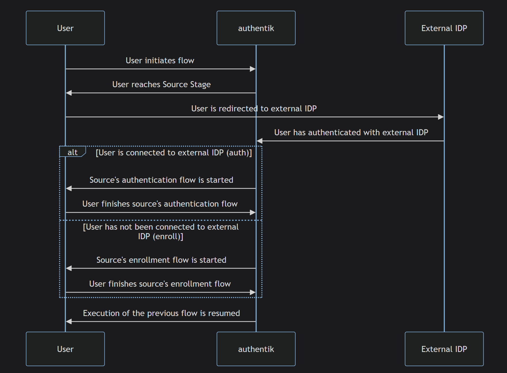

# Authentik

**Authentik** es una solución de gestión de identidades y accesos (IAM) de código abierto. Se utiliza para autenticar y autorizar a los usuarios en aplicaciones y sistemas, proporcionando una forma de gestionar identidades, permisos y acceso a recursos.

## Características Clave

- **Autenticación Multifactor (MFA)**: Ofrece métodos de autenticación adicionales para mejorar la seguridad.
- **Federación de Identidades**: Permite integrar múltiples sistemas de autenticación y gestionar identidades de manera centralizada.
- **Autorización y Permisos**: Ofrece herramientas para definir y gestionar qué recursos están disponibles para cada usuario o grupo.
- **Interfaz de Usuario Amigable**: Suele tener una interfaz gráfica para simplificar la configuración y gestión.
- **Integración con Aplicaciones**: Compatible con una amplia gama de aplicaciones y servicios, facilitando la integración en entornos diversos.

Es especialmente útil en entornos empresariales y de desarrollo donde la gestión de usuarios y el control de acceso son cruciales.

# Firezone

**Firezone** es una solución de código abierto para crear y gestionar redes privadas virtuales (VPN). Está diseñada para simplificar la configuración y administración de VPNs seguras, proporcionando una forma efectiva de conectar de manera segura redes y usuarios.

## Características Clave

- **Fácil Configuración**: Proporciona una interfaz intuitiva para configurar y gestionar redes VPN.
- **Seguridad Avanzada**: Implementa estándares modernos de cifrado y autenticación para garantizar la seguridad de las conexiones.
- **Acceso Controlado**: Permite definir y controlar quién puede acceder a la red y qué recursos están disponibles para cada usuario.
- **Interfaz de Usuario Amigable**: Ofrece una interfaz gráfica para facilitar la administración y monitorización de la VPN.
- **Integración con Otras Herramientas**: Compatible con diversas herramientas y servicios para una integración fluida en entornos diversos.

Firezone es ideal para organizaciones que buscan una solución VPN robusta y fácil de gestionar, proporcionando tanto seguridad como flexibilidad en la conectividad remota.

# Requisitos del Sistema

## Authentik

Para **Authentik**, los requisitos mínimos del sistema pueden variar según el tamaño y las necesidades específicas de la implementación, pero en general, se recomiendan las siguientes especificaciones:

- **CPU**: 2 núcleos (recomendado: 4 núcleos)
- **RAM**: 4 GB (recomendado: 8 GB)
- **Espacio en Disco**: 10 GB (recomendado: 20 GB)
- **Sistema Operativo**: Linux (Ubuntu, Debian, CentOS, etc.)
- **Docker**: Autentik generalmente se ejecuta en contenedores Docker, por lo que necesitarás Docker y Docker Compose instalados.
- **Base de Datos**: Puede usar PostgreSQL o MySQL.
- **Red**: Conexión a Internet para la instalación de dependencias y actualizaciones.

## Firezone

Para **Firezone**, los requisitos del sistema son relativamente modestos y suelen incluir:

- **CPU**: 1 núcleo (recomendado: 2 núcleos)
- **RAM**: 2 GB (recomendado: 4 GB)
- **Espacio en Disco**: 5 GB (recomendado: 10 GB)
- **Sistema Operativo**: Linux (Ubuntu, Debian, etc.)
- **Docker**: Firezone también se ejecuta en contenedores Docker, por lo que necesitarás Docker y Docker Compose instalados.
- **Red**: Conexión a Internet para la instalación de dependencias y actualizaciones.

Estos requisitos pueden variar dependiendo del tamaño de la implementación y del número de usuarios. Es recomendable consultar la documentación oficial de cada herramienta para obtener los requisitos más actualizados y específicos.

# Dependencias Técnicas

## Autentik

Para **Authentik**, las principales dependencias técnicas son:

- **Docker**: Autentik se ejecuta en contenedores Docker. Asegúrate de tener Docker instalado en tu sistema.
- **Docker Compose**: Se utiliza para definir y ejecutar aplicaciones multi-contenedor. Autentik suele requerir Docker Compose para gestionar sus servicios.
- **Base de Datos**: Autentik puede usar PostgreSQL o MySQL como su sistema de gestión de bases de datos. Debes tener una instancia de base de datos configurada y accesible.
- **Sistema Operativo**: Requiere un sistema operativo compatible con Docker, como Ubuntu, Debian, o CentOS.

## Firezone

Para **Firezone**, las principales dependencias técnicas son:

- **Docker**: Firezone se ejecuta en contenedores Docker. Asegúrate de tener Docker instalado en tu sistema.
- **Docker Compose**: Se utiliza para gestionar los servicios de Firezone. Docker Compose facilita la configuración y el despliegue de Firezone y sus componentes.
- **Sistema Operativo**: Requiere un sistema operativo compatible con Docker, como Ubuntu o Debian.

Estas herramientas de contenedorización y orquestación son esenciales para el despliegue y funcionamiento de Authentik y Firezone, simplificando la administración y escalabilidad de ambos sistemas.

# Etapa de Fuente

La etapa de **Fuente** inyecta una fuente OAuth o SAML en la ejecución del flujo. Esto permite una verificación adicional del usuario, o acceder dinámicamente a diferentes fuentes para diferentes identificadores de usuario (nombre de usuario, dirección de correo electrónico, etc.).

## Consideraciones

Es muy importante que los flujos de autenticación y registro de la fuente configurada (cuando están establecidos; pueden dejarse sin seleccionar para evitar la autenticación o el registro con la fuente) **no tengan una etapa de Inicio de Sesión del Usuario asociada**.

Esto se debe a que la etapa de Fuente funciona añadiendo una etapa dinámica en memoria al flujo de la fuente. Por lo tanto, tener una etapa de Inicio de Sesión del Usuario asociada hará que el flujo de la fuente no reanude el flujo original desde el que se inició, y en su lugar autenticará directamente al usuario pendiente.
