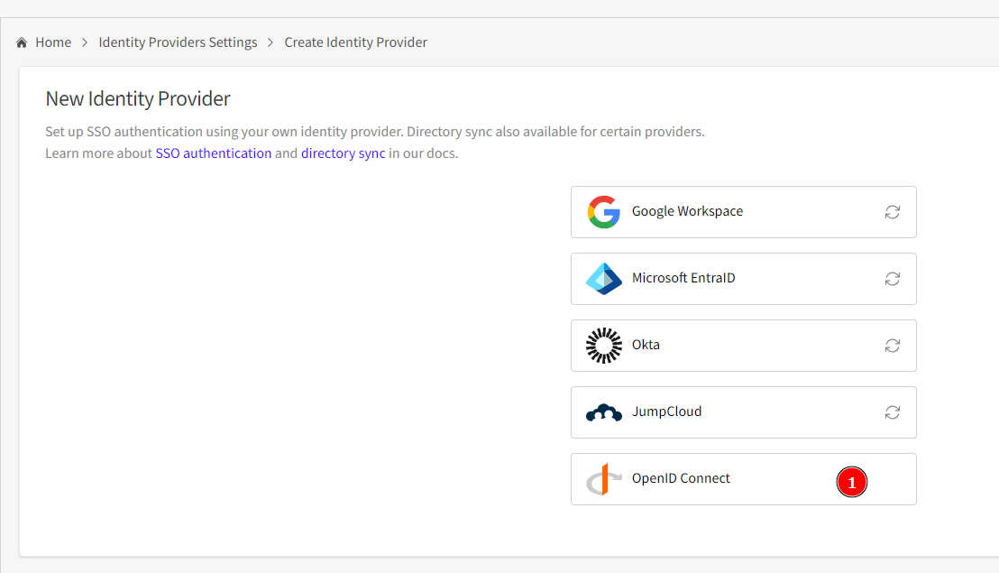

## Conexión y Configuración

### 1. Conectar a Authentik

Por defecto, Authentik se ejecuta en el puerto 9000 (aunque también puede estar disponible en los puertos 80 o 443). Asegúrate de conectarte a la URL adecuada para acceder a la interfaz de Authentik.

### 2. Crear una Aplicación en Authentik

Sigue estos pasos para crear una nueva aplicación en Authentik:
- Navega a la sección correspondiente para la creación de aplicaciones.

- Introduce y configura los valores deseados según los requisitos de tu aplicación.

### 3. Configurar Firezone

Conéctate a la instancia de Firezone en el lado del servidor (server side) y realiza los siguientes pasos:
- Accede a la opción de **Identity Provider**.

- Selecciona **OIDC** (OpenID Connect) como el tipo de proveedor de identidad.

### 4. Intercambiar Valores de Configuración

- Una vez configurada la aplicación en Authentik y Firezone, intercambia los valores generados por Firezone con Authentik.

- Asegúrate de que ambos sistemas realicen un "handshake" exitoso para establecer una conexión segura y funcional.

Estos pasos te guiarán para establecer una integración correcta entre Authentik y Firezone.
