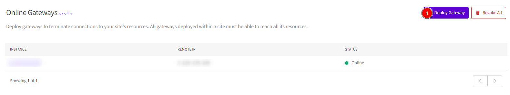
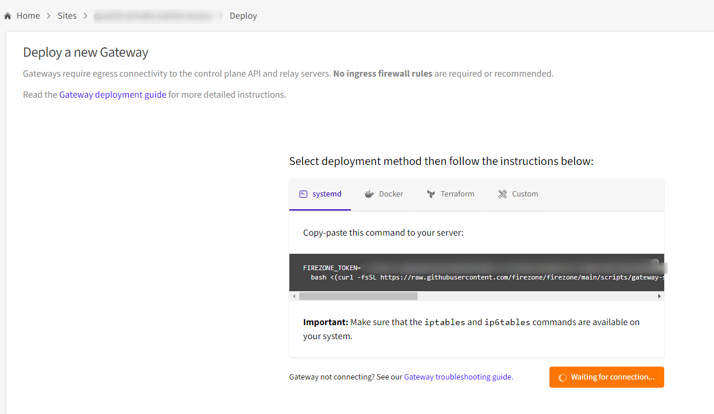

# Descripción del Script de Instalación de Firezone

Este script está diseñado para desplegar un **gateway** utilizando el servidor en la nube de Firezone. Firezone ofrece una solución de VPN que se puede configurar mediante un token proporcionado por la plataforma.

## ¿Qué Hace el Script?

1. **Solicita el Token de Firezone:**
   - El script solicita al usuario que ingrese un token de Firezone. Este token es necesario para autenticar y autorizar el despliegue del gateway.

2. **Ejecución del Script de Instalación:**
   - Utiliza el token proporcionado para ejecutar el script de instalación de Firezone desde el repositorio oficial. Este script configura y despliega el gateway en tu sistema.

## Token de Firezone

### Obtención del Token

- **En la Versión Cloud:**
  - El token es generado automáticamente por la plataforma cuando te creas una cuenta en el servidor en la nube de Firezone. 
  - Generalmente, el token se encuentra en un archivo en la ruta: `app.domain.dev./ACCOUNTSLUG/sites/`
    - **`domain`**: Especifica el dominio que defines al crear tu cuenta en el cloud de Firezone.
    - **`ACCOUNTSLUG`**: Es un identificador generado automáticamente por la plataforma.

- **En la Versión Self-Hosted:**
  - En una instalación self-hosted, el token también se genera y se guarda en un archivo en una ubicación similar, la cual debes especificar al configurar el entorno.

## Instrucciones para el Usuario

1. **Ejecuta el Script:**
   - Guarda el script proporcionado en un archivo, por ejemplo, `install_firezone.sh`.
   - Dale permisos de ejecución con el comando `chmod +x install_firezone.sh`.
   - Ejecuta el script con `./install_firezone.sh`.

2. **Proporciona el Token:**
   - Durante la ejecución, se te pedirá que ingreses el token de Firezone. Asegúrate de ingresar el token correcto para completar la instalación correctamente.

Este script simplifica el proceso de configuración de un gateway de Firezone al automatizar la instalación y configuración, utilizando el token de autenticación necesario para integrarse con el servidor de Firezone en la nube.

